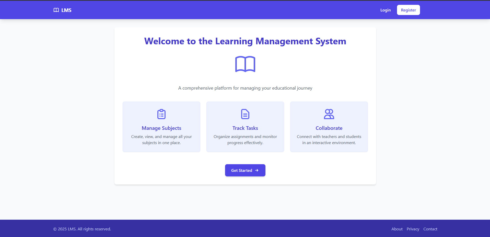

# Learning Management System (LMS)

A minimal Learning Management System built with Laravel and React for managing courses and users.




## Setup (Local)

### Clone the Repository
```bash
git clone https://github.com/haseebraza715/LMS.git
```

### Backend Installation
```bash
composer install
cp .env.example .env
php artisan key:generate
```

### Database Migration and Seeding
```bash
php artisan migrate:fresh --seed
```

### Start the Backend Server
```bash
php artisan serve
```

### Frontend Installation (React)
```bash
cd frontend
npm install
npm run dev
```

## Deployment

- The Laravel backend is Dockerized.
- SQLite database is automatically created.

## About

This is a minimal LMS developed using Laravel for the backend and React for the frontend, designed to handle course and user management efficiently.
